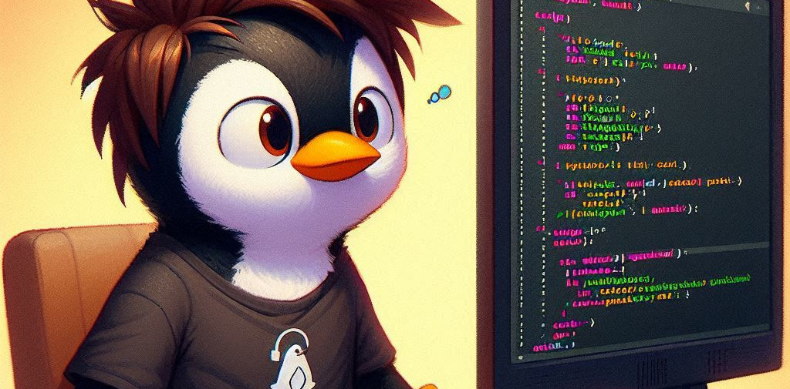
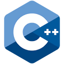

## Details:
&nbsp;
Hello my name is Amirmohammad, Computer Engineering student specializing in Go development (Web applications). Linux and FOSS lover. Seeking opportunities to work on innovative projects with a team.

## Skills:
### platforms: 

### Main stack:

### Skilled with: 

